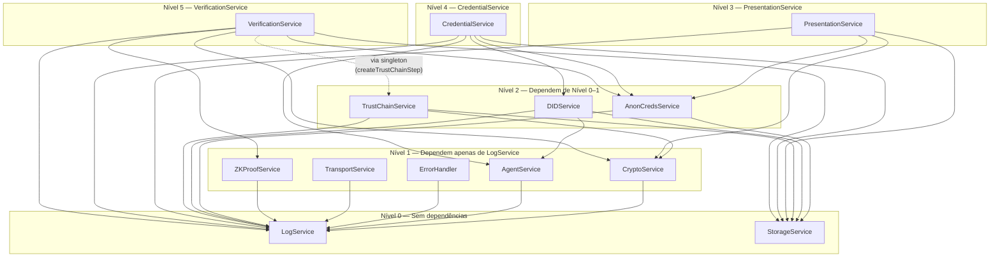

# Arquitetura

## Visão geral

Aplicativo React Native 0.76.5 (Android) que implementa os três papéis do modelo SSI (Emissor, Titular, Verificador) em um único binário. A troca de credenciais e apresentações é feita via área de transferência (clipboard). Não há comunicação de rede entre os papéis.

## Camadas

```
┌─────────────────────────────────────────────────────────┐
│                    UI (React Native)                     │
│  Screens: Home, Issuer, Holder, Verifier, Logs, Glossary│
│  Hooks: useHolderState, useIssuerState                   │
│  Components: ConsentModal, CredentialCard,               │
│              TrustChainSection, AttributeSelector, etc.  │
├─────────────────────────────────────────────────────────┤
│              Service Layer (Dependency Injection)         │
│  AgentService  │ AnonCredsService │ CredentialService    │
│  DIDService    │ PresentationService │ VerificationService│
│  ZKProofService│ CryptoService   │ TransportService     │
│  StorageService│ LogService      │ ErrorHandler           │
│  Helpers: PresentationHelpers, VerificationSteps         │
│  Subsystems: presentations/ (4 builders), verification/   │
│             (8 colaboradores), encoding.ts (Hermes shim) │
│  Composition Root: container.ts                          │
├─────────────────────────────────────────────────────────┤
│                    Utilities                             │
│  constants.ts (Module, CredentialFormat, StorageKey, etc)│
│  formatters.ts │ errorMessages.ts                       │
│  accessibility.ts │ glossary.ts │ theme.ts               │
├──────────────────────────────────────────────────────┤
│                 Native Libraries (JSI/Rust)              │
│  @credo-ts/core        │ @hyperledger/aries-askar-react-native │
│  @hyperledger/anoncreds-react-native │ mopro-ffi (Circom/Groth16) │
├─────────────────────────────────────────────────────────┤
│              Encrypted Storage (OS-level)                │
│  react-native-encrypted-storage (AES-256 via Keystore)  │
└─────────────────────────────────────────────────────────┘
```

## Serviços

### AgentService

Singleton que inicializa e gerencia o agente Credo (`@credo-ts/core`). O agente é configurado com:
- **AskarModule** (`@hyperledger/aries-askar-react-native`): wallet criptográfico para armazenamento de chaves Ed25519 e operações de assinatura.
- **AnonCredsModule** (`@hyperledger/anoncreds-react-native`): bindings nativos AnonCreds passados ao módulo Credo. Registries vazias (`registries: []`) porque os artefatos AnonCreds são gerenciados localmente pelo AnonCredsService.

Wallet configurado com derivação de chave Argon2IMod. Sem transportes DIDComm.

### AnonCredsService

Encapsula o protocolo CL-signature da biblioteca `@hyperledger/anoncreds-react-native`. Implementa:

1. **Schema**: `Schema.create({issuerId, name, version, attributeNames})`
2. **CredentialDefinition**: `CredentialDefinition.create({schemaId, schema, signatureType: 'CL', issuerId})` — gera credDef + credDefPrivate + keyCorrectnessProof
3. **LinkSecret**: `LinkSecret.create()` — fator de cegamento do titular para desvinculabilidade
4. **Offer → Request → Credential**: Protocolo de emissão em 3 passos
5. **Presentation**: `Presentation.create()` — ZKP com divulgação seletiva e provas de predicado
6. **Verification**: `Presentation.verify()` — verificação criptográfica

Todos os artefatos (schemas, cred defs, link secrets) são persistidos em `EncryptedStorage` via StorageService. Não há ledger.

### CredentialService

Emissão de credenciais em dois formatos:

- **SD-JWT** (`'sd-jwt'`): constrói JWT `header.payload.signature`. A assinatura Ed25519 é feita via `agent.wallet.sign()` (Aries Askar) usando o DID de assinatura recuperado de `StorageService.getIssuerSigningDid()`. O TTL do JWT (`exp - iat`) é parametrizável via construtor (`credentialTtlSeconds`, default `CREDENTIAL_DEFAULT_TTL_SECONDS = 365 * 24 * 60 * 60`). `iat` e `exp` são derivados do mesmo `nowSeconds` para evitar drift.
- **AnonCreds** (`'anoncreds'`): delega para `AnonCredsService.issueCredentialFull()` que executa o protocolo completo (Schema → CredDef → Offer → Request → Credential → Process). O resultado é um envelope JSON `{format: 'anoncreds', credential, schema_id, cred_def_id}`.

Parsing: `validateAndParseCredential()` utiliza um registro de formatos (`ICredentialFormat[]`) para detectar e processar o token. Formatos padrão (AnonCreds, SD-JWT) são registrados automaticamente. Novos formatos podem ser adicionados via `registerFormat()` sem modificar o código existente (Princípio Aberto/Fechado). A detecção usa o padrão "first match wins".

### DIDService

Criação de DIDs via agente Credo:
- `did:key` — via `agent.dids.create({method: 'key'})`. Usado para titulares.
- `did:peer` — via `agent.dids.create({method: 'peer'})`.
- `did:web` — construído localmente com validação estrita: o domínio passa por regex RFC-1123 (`/^(?=.{1,253}$)([a-zA-Z0-9](?:[a-zA-Z0-9-]{0,61}[a-zA-Z0-9])?)(\.[a-zA-Z0-9](?:[a-zA-Z0-9-]{0,61}[a-zA-Z0-9])?)*(:\d{1,5})?$/`) e o path por lista branca `/^[A-Za-z0-9._\-/%]+$/`. Portas são percent-encoded (`:8080` → `%3A8080`) conforme W3C did:web. Entrada inválida lança `CryptoError`.

`generateIssuerIdentity()` cria um `did:key` para assinatura e um `did:web` para identidade pública. Ambos são armazenados.

### PresentationService (façade)

Façade fina sobre quatro colaboradores em `src/services/presentations/`. Cada um implementa uma estratégia de construção de apresentação:

| Colaborador | Responsabilidade |
|---|---|
| `PEXValidator` | Valida o envelope `PresentationExchangeRequest` (PEX 1.0.0), extrai atributos requeridos/opcionais e monta o `ConsentData` com base na credencial selecionada. |
| `SDJWTPresentationBuilder` | Extrai atributos selecionados, calcula hashes SHA-256 dos atributos não revelados e assina a apresentação com chave privada do titular via `CryptoService`. Re-exporta `canonicalPresentationSigningInput` para que o verificador reconstrua exatamente a mesma forma canônica. |
| `ZKPPresentationBuilder` | Para cada predicado, gera prova ZK Groth16 via `ZKProofService` (mopro-ffi). Circuitos: `age_range`, `status_check`, `nullifier`. Proof type: `Groth16Proof`. |
| `AnonCredsPresentationBuilder` | Constrói a presentation request AnonCreds, recupera artefatos (schema, credDef, link secret) do storage, executa `AnonCredsService.createPresentation()` com CL-signatures. Proof type: `CLSignature2023`. |

A façade preserva a API pública (`createPresentation`, `createZKPPresentation`, `createAnonCredsPresentation`, `validatePEXFormat`, `extractRequestedAttributes`, `processPEXRequest`, `copyPresentationToClipboard`) para não quebrar telas e testes existentes.

Nullifiers para eleições: o builder ZKP tenta usar o circuito Circom `nullifier`; se indisponível, faz fallback determinístico via `crypto.computeCompositeHash([credentialSubject.cpf, electionId])`.

`PresentationHelpers.ts` mantém funções auxiliares puras reusadas pelos builders (`evaluatePredicate`, `extractDisclosedAttributes`, `obfuscateNonDisclosedAttributes`, `generateZKPProofs`, `generateNullifier`).

### VerificationService (façade)

Façade fina sobre oito colaboradores em `src/services/verification/`. O entrypoint público `validatePresentation()` constrói um `VerificationPipeline` (Chain of Responsibility) com sete passos independentes:

1. **SignatureVerification** (`SignatureVerifier`) — dispatch por proof type: `Groth16Proof`, `CLSignature2023`, `JsonWebSignature2020`. Para AnonCreds, delega ao `IntegrityVerifier.verifyAnonCredsPresentation`.
2. **TrustChainVerification** — valida a cadeia PKI via `TrustChainService.verifyTrustChain()`. O step usa o singleton diretamente.
3. **StructuralIntegrity** (`IntegrityVerifier`) — atributos esperados presentes, hashes corretos, formato de campos ZKP.
4. **ChallengeVerification** — confere o challenge da apresentação contra o emitido pelo PEX.
5. **PredicateVerification** (`PredicateChecker`) — avalia cada predicado declarativo (`>=`, `<=`, `>`, `<`, `==`).
6. **NullifierVerification** (`NullifierStore`) — anti-replay para o cenário `elections` (insere o nullifier; rejeita se já visto).
7. **ResourceAccessVerification** (`ResourceAccessChecker`) — controle de acesso a laboratórios e prédios.

Colaboradores adicionais que não entram no pipeline:

- `ScenarioCatalog` — catálogo de cenários pré-configurados (`ru`, `elections`, `age_verification`, `lab_access`) e geração de `PresentationExchangeRequest`. O `VerifierScreen` reusa exatamente os mesmos IDs (apenas o rótulo em português para o seletor da UI é mantido localmente).
- `PresentationFormatValidator` — normaliza string → `VerifiablePresentation` antes do pipeline.

As sete fábricas de passos (`createSignatureStep`, `createTrustChainStep`, `createIntegrityStep`, `createChallengeStep`, `createPredicateStep`, `createNullifierStep`, `createResourceAccessStep`) vivem em `VerificationSteps.ts` e recebem uma interface `IVerificationOperations` para evitar import circular. Os nomes dos passos são constantes em `VerificationStepName` (`utils/constants.ts`).

**Segurança reforçada (P0)**: a verificação AnonCreds lança `ValidationError` quando os artefatos do emissor (schema, credDef) não estão disponíveis. A verificação ZKP rejeita provas Groth16 quando o `.zkey` do circuito não existe e quando algum dos campos `proof.{a,b,c,publicInputs}` está ausente.

### TrustChainService

Emula uma infraestrutura PKI hierárquica para emissores confiáveis. Modelo:

```
did:web:ufsc.br (Âncora Raiz — self-signed)
├── did:web:ctc.ufsc.br (Centro Tecnológico — assinado pela raiz)
│   └── did:web:ine.ufsc.br (Dept. Informática — assinado pelo CTC)
└── did:web:cagr.ufsc.br (CAGR — assinado pela raiz)
```

Cada emissor possui: DID, par de chaves Ed25519, nome, DID do pai, e certificado (assinatura do pai sobre os dados do emissor).

Operações principais:
- `initializeRootIssuer(did, name)`: Gera par Ed25519, auto-assina certificado, persiste.
- `registerChildIssuer(parentDid, parentPrivateKey, childDid, childName)`: Gera par Ed25519 para o filho, pai assina certificado sobre `{did, publicKey, name, parentDid}`.
- `verifyTrustChain(issuerDid)`: Percorre a cadeia do emissor até a raiz, verificando cada certificado com a chave pública do pai. Detecta ciclos via conjunto de DIDs visitados.
- `getAllIssuers()`, `isTrustedIssuer(did)`, `getIssuerPrivateKey(did)`, `reset()`.

Armazenamento via `StorageService.setRawItem('trust_chain_issuers', ...)`. Chaves privadas armazenadas em `trust_root_private_key` e `trust_issuer_private_key_${did}`.

### ZKProofService

Wrapper sobre `mopro-ffi` (Rust via UniFFI). Três circuitos suportados:

- `age_range`: inputs = [birthdate_as_number, threshold]. Prova que idade ≥ threshold.
- `status_check`: inputs = [value_hash, expected_hash]. Prova igualdade sem revelar valor.
- `nullifier`: inputs = [secret_hash, election_id_hash]. Gera nullifier determinístico dentro do circuito.

Circuitos são arquivos `.zkey` esperados em `RNFS.DocumentDirectoryPath/circuits/`.

### CryptoService

Operações criptográficas de baixo nível independentes do agente Credo:
- `computeHash(data, module)`: SHA-256 via `crypto-js`
- `signData(data, privateKeyHex, module)`: Ed25519 via `@noble/ed25519`
- `verifySignature(data, signatureHex, publicKeyHex)`: Ed25519
- `generateNonce()`: Nonce criptográfico
- `computeCompositeHash(parts[], module)`: Hash de múltiplas partes

Usado pelo PresentationService (SD-JWT hashing/signing) e VerificationService (SD-JWT verification).

**Segurança**: O fallback para `Math.random()` foi removido. Se `react-native-get-random-values` não estiver disponível, o serviço lança `CryptoError` em vez de gerar bytes previsíveis.

### TransportService

Seleção mínima do modo de transporte usado pela UI do titular/verificador. Dois modos:
- `clipboard` (default): troca manual via área de transferência.
- `qrcode`: o titular renderiza a apresentação como QR code (via `react-native-qrcode-svg`) e o verificador faz a leitura.

O antigo `EudiTransportService`, baseado em `@openwallet-foundation/eudi-wallet-kit-react-native`, foi removido nesta versão. Modos por proximidade BLE (ISO 18013-5 mDoc) e remoto (OpenID4VP) ficaram fora de escopo — sem implementação React Native amplamente adotada como subsitituto. Veja [DESIGN_DECISIONS.md](DESIGN_DECISIONS.md#transporte-de-apresentações) para o registro da decisão.

### StorageService

Wrapper sobre `react-native-encrypted-storage`. Armazena:
- Chaves privadas/públicas do titular e emissor
- DIDs
- Credenciais (array JSON)
- Nullifiers por eleição
- Artefatos AnonCreds (schemas, cred defs, link secrets) via `setRawItem()`/`getRawItem()`

Chaves de armazenamento são definidas como constantes em `StorageKey` (`utils/constants.ts`), evitando strings mágicas repetidas.

**Proteção contra condições de corrida**: operações read-modify-write em arrays (credenciais e nullifiers) são protegidas por um mutex per-key. Operações concorrentes na mesma chave são serializadas; chaves diferentes podem ser processadas em paralelo.

### LogService

Registro de eventos criptográficos com dados sensíveis ofuscados. Cada entrada contém: operação, módulo (emissor/titular/verificador), algoritmo, resultado, timestamp.

**Buffer circular**: o store mantém no máximo 1000 entradas. Ao adicionar a 1001ª, a mais antiga é descartada. Esse limite vive em `useAppStore.addLog` (não no LogService) para evitar vazamento de memória em sessões longas.

### Encoding shim

`src/services/encoding.ts` é um polyfill mínimo para o engine Hermes do React Native 0.76, que não expõe globais `Buffer` / `TextEncoder` / `TextDecoder` por padrão. O módulo é importado em ponto único e re-exporta utilitários `utf8ToBytes`, `bytesToUtf8`, `stringToBase64Url` e `base64UrlToBytes` para uso pelos serviços criptográficos.

## Fluxos de dados

### Emissão (SD-JWT)

```
IssuerScreen
  → CredentialService.issueCredential(studentData, holderDID, 'sd-jwt')
    → getOrCreateIssuerDID()
      → DIDService.generateIssuerIdentity() → agent.dids.create({method:'key'})
    → createVerifiableCredential()
    → signCredentialAsSDJWT()
      → AgentService.getAgent()
      → StorageService.getIssuerSigningDid()
      → agent.dids.resolve(signingDid)
      → agent.wallet.sign({data, key})
    → return JWT string (header.payload.signature)
```

### Emissão (AnonCreds)

```
IssuerScreen
  → CredentialService.issueCredential(studentData, holderDID, 'anoncreds')
    → signCredentialAsAnonCreds()
      → AnonCredsService.issueCredentialFull()
        → Schema.create()
        → CredentialDefinition.create()  → stores credDefPrivate locally
        → LinkSecret.create()            → stored in EncryptedStorage
        → CredentialOffer.create()
        → CredentialRequest.create()
        → Credential.create()            → CL-signed
        → credential.process()           → blinded with link secret
      → return JSON envelope {format:'anoncreds', credential, schema_id, cred_def_id}
```

### Apresentação (AnonCreds)

```
HolderScreen
  → PresentationService.createAnonCredsPresentation(token, pexRequest, revealedAttrs, predicates)
    → Parse envelope, recover schema + credDef from storage
    → AnonCredsService.getOrCreateLinkSecret()
    → AnonCredsService.buildPredicateRequest()
    → AnonCredsService.createPresentation()  → CL-signature ZKP
    → return VerifiablePresentation with type='CLSignature2023'
```

### Verificação

```
VerifierScreen
  → VerificationService.validatePresentation(presentation, pexRequest)
    → validatePresentationFormat()
    → verifyIssuerSignature()
      ├─ CLSignature2023 → verifyAnonCredsPresentation()
      │                     → AnonCredsService.verifyPresentation()
      ├─ Groth16Proof    → accept (verified in ZKP integrity step)
      └─ JWS             → CryptoService.verifySignature()
    → verifyIntegrity()
      ├─ ZKP presentation → verifyZKPIntegrity()
      │                     → ZKProofService.verifyProof() per predicate
      └─ Standard         → verifyStandardIntegrity()
    → validatePredicates()
    → checkNullifier() (if election)
```

## Modelo de dados

### StudentData (atributos da credencial)

```typescript
interface StudentData {
  nome_completo: string;
  cpf: string;            // 11 dígitos
  matricula: string;
  curso: string;
  status_matricula: 'Ativo' | 'Inativo';
  data_nascimento: string; // YYYY-MM-DD
  alojamento_indigena: boolean;
  auxilio_creche: boolean;
  auxilio_moradia: boolean;
  bolsa_estudantil: boolean;
  bolsa_permanencia_mec: boolean;
  paiq: boolean;
  moradia_estudantil: boolean;
  isencao_ru: boolean;
  isencao_esporte: boolean;
  isencao_idiomas: boolean;
  acesso_laboratorios: string[];
  acesso_predios: string[];
}
```

### Formatos de credencial na wire

**SD-JWT**: `base64url(header).base64url(payload).base64url(signature)` — JWT padrão com `payload.vc` contendo a VerifiableCredential.

**AnonCreds envelope**: `{"format":"anoncreds","credential":{...},"schema_id":"...","cred_def_id":"..."}` — o campo `credential` contém o objeto AnonCreds com `values`, `signature`, `schema_id`, `cred_def_id`.

### Proof types em apresentações

| Proof type | Serviço | Uso |
|---|---|---|
| `JsonWebSignature2020` | CryptoService (Ed25519) | SD-JWT selective disclosure |
| `Groth16Proof` | ZKProofService (mopro-ffi) | Circuitos Circom customizados |
| `CLSignature2023` | AnonCredsService | AnonCreds selective disclosure + predicados |

## Dependências nativas

Todos os módulos abaixo requerem bindings nativos (Rust/C++ via JSI) e não funcionam em testes sem mocks:

- `@credo-ts/core` + `@credo-ts/react-native` + `@credo-ts/askar` + `@credo-ts/anoncreds`
- `@hyperledger/aries-askar-react-native`
- `@hyperledger/anoncreds-react-native`
- `mopro-ffi`
- `react-native-encrypted-storage`

Mocks para todos estão em `__mocks__/` e `jest.setup.js`.

### Estrutura de mocks (`__mocks__/`)

Os mocks substituem os módulos nativos durante execução de testes Jest (que roda em Node.js, sem bindings Android):

| Mock | Módulo real | O que faz |
|---|---|---|
| `react-native-encrypted-storage.ts` | react-native-encrypted-storage | Key-value store em memória (Map), substitui AES-256 |
| `react-native-get-random-values.ts` | react-native-get-random-values | Stub do polyfill crypto.getRandomValues |
| `mopro-ffi.ts` | mopro-ffi | Retorna provas/verificações fake para `generateCircomProof`/`verifyCircomProof` |
| `@credo-ts/core.ts` | @credo-ts/core | Agent stub com `dids.create()`, `dids.resolve()`, `wallet.sign()` |
| `@credo-ts/react-native.ts` | @credo-ts/react-native | Stub de `agentDependencies` |
| `@credo-ts/askar.ts` | @credo-ts/askar | Stub de `AskarModule` |
| `@credo-ts/anoncreds.ts` | @credo-ts/anoncreds | Stub de `AnonCredsModule` |
| `@hyperledger/aries-askar-react-native.ts` | @hyperledger/aries-askar-react-native | Stub de `ariesAskar` |
| `@hyperledger/anoncreds-react-native.ts` | @hyperledger/anoncreds-react-native | Mock completo do protocolo CL-signature: Schema, CredentialDefinition, Credential, Presentation, LinkSecret com métodos create/fromJson/toJson/process/verify |

O `jest.config.js` configura `moduleNameMapper` para redirecionar imports para esses mocks. Mocks adicionais de serviços (AgentService, ZKProofService, AnonCredsService) são definidos em `jest.setup.js` via `jest.mock()`.

## Estado (Zustand)

Store único (`useAppStore`) com:
- `holderDID`, `issuerDID`: DIDs ativos
- `credentials`: array de credenciais armazenadas
- `logs`: histórico de eventos criptográficos (máximo 1000 entradas — circular buffer para evitar vazamento de memória)
- `nullifiers`: mapa electionId → string[] para prevenção de voto duplicado

## Padrões de Projeto (Design Patterns)

### Singleton + Dependency Injection
Todos os 13 serviços são exportados como instância singleton (`export default new Service()`) para manter compatibilidade, mas cada classe também aceita dependências via **injeção no construtor**. As dependências têm valores padrão apontando para os singletons:

```typescript
class CryptoService {
  constructor(logger: ILogService = LogServiceInstance) {
    this.logger = logger;
  }
}
export { CryptoService };                      // Named export (classe)
export default new CryptoService();             // Default export (singleton)
```

Uma **composition root** em `src/container.ts` instancia todos os serviços na ordem correta de dependência e os exporta como um conjunto coeso:

```
Level 0 (folhas):    LogService, StorageService
Level 1:             CryptoService, AgentService, ErrorHandler, TransportService
Level 2:             DIDService, AnonCredsService, ZKProofService, TrustChainService
Level 3:             CredentialService
Level 4:             PresentationService
Level 5:             VerificationService
```

Para testes, basta criar instâncias diretamente com mocks: `new CryptoService(mockLogger)` — sem necessidade de `jest.mock()`.

### Facade
Serviços de alto nível (CredentialService, PresentationService, VerificationService) ocultam a complexidade de múltiplos serviços internos. As telas interagem apenas com a fachada:
- `CredentialService.issueCredential()` → orquestra DIDService, AgentService, AnonCredsService
- `PresentationService.createPresentation()` → orquestra CryptoService, ZKProofService, AnonCredsService
- `VerificationService.validatePresentation()` → orquestra pipeline de validação completo

### Chain of Responsibility / Pipeline (`VerificationPipeline`)
A validação de apresentações utiliza o padrão Pipeline (cadeia de responsabilidade), implementado em `VerificationPipeline.ts`:

```typescript
const pipeline = new VerificationPipeline()
  .register(signatureStep)      // Verifica assinatura Ed25519
  .register(trustChainStep)     // Valida cadeia de confiança PKI
  .register(integrityStep)      // Integridade estrutural
  .register(challengeStep)      // Challenge PEX
  .register(predicateStep)      // Predicados (age >= 18, status == 'Ativo')
  .register(nullifierStep)      // Anti-replay para eleições
  .register(resourceAccessStep) // Controle de acesso a laboratórios
```

Cada passo implementa `IVerificationStep` e é independente. Novos passos podem ser adicionados sem modificar os existentes (Princípio Aberto/Fechado). Falhas acumulam-se no `VerificationContext` compartilhado — a pipeline não interrompe ao primeiro erro.

### Strategy
Dois pontos de variação via Strategy:
- **Formato de credencial**: `issueCredential(data, did, 'sd-jwt' | 'anoncreds')` — implementações distintas para SD-JWT (JWT + Ed25519) e AnonCreds (CL-signatures)
- **Modo de transporte**: `TransportService('clipboard' | 'qrcode')`

### Open/Closed Principle — Registro de Formatos
`CredentialService` mantém um registro de formatos (`ICredentialFormat[]`) que permite adicionar novos formatos de credencial sem modificar a lógica de parsing:

```typescript
CredentialService.registerFormat({
  name: 'mdoc',
  detect: (token, parsed) => parsed?.docType === 'org.iso.18013.5.1',
  parse: (token) => parseMdocCredential(token),
});
```

Formatos padrão (AnonCreds, SD-JWT) são registrados no construtor. A detecção usa o padrão "first match wins" — o primeiro formato cujo `detect()` retorna `true` é utilizado.

### Repository / DAO
`StorageService` abstrai o `EncryptedStorage` como repositório de dados. Toda persistência passa por esse serviço, permitindo trocar a implementação de storage sem afetar a lógica de negócio.

### Observer
`LogService` funciona como coletor de eventos. Todos os serviços emitem eventos via `LogService.captureEvent()`, armazenados no Zustand store e exibidos na tela de logs.

## Interfaces de Serviço (Dependency Inversion)

Interfaces definidas em `types/index.ts` para os serviços principais:

| Interface | Serviço | Propósito |
|-----------|---------|-----------|
| `ICryptoService` | CryptoService | Hash SHA-256, assinatura Ed25519, verificação |
| `IStorageService` | StorageService | Persistência encriptada, mutex per-key |
| `ICredentialService` | CredentialService | Emissão e parsing de credenciais |
| `ITrustChainService` | TrustChainService | Gestão da cadeia de confiança PKI |
| `IVerificationService` | VerificationService | Validação de apresentações |
| `ILogService` | LogService | Captura e filtragem de eventos criptográficos |
| `IAgentService` | AgentService | Ciclo de vida do agente Credo |
| `IDIDService` | DIDService | Criação de DIDs (did:key, did:peer, did:web) |
| `IAnonCredsService` | AnonCredsService | Protocolo CL-signature completo |
| `IZKProofService` | ZKProofService | Geração e verificação de provas Groth16 (mopro-ffi) |
| `IVerificationStep` | (pipeline steps) | Passos individuais de validação |
| `ICredentialFormat` | (format registry) | Detecção e parsing de formatos |

Essas interfaces seguem o Princípio da Inversão de Dependência (DIP) e Segregação de Interface (ISP), permitindo que implementações sejam substituídas em testes ou futuramente em produção.

## Grafo de Dependências

O diagrama abaixo mostra a hierarquia de injeção de dependências entre os serviços. Setas indicam "depende de".



A composição é centralizada em `src/container.ts`, que instância os serviços em ordem topológica (nível 0 → nível 5).

## Segurança Reforçada

Três vulnerabilidades críticas foram corrigidas:

1. **CryptoService — Remoção do fallback `Math.random()`**: O gerador de bytes aleatórios agora lança `CryptoError` se o polyfill `react-native-get-random-values` não estiver disponível, em vez de recorrer a `Math.random()`, que é previsível e inseguro para uso criptográfico.

2. **VerificationService — Remoção do bypass AnonCreds**: A verificação AnonCreds anteriormente retornava `true` como placeholder. Agora lança `ValidationError` exigindo a implementação real via `@credo-ts` antes de aceitar credenciais AnonCreds.

3. **VerificationService — Remoção do fallback ZKP**: A verificação de provas de conhecimento zero agora rejeita provas de circuitos não reconhecidos (`legacyProof`, etc.) com `ValidationError`, em vez de aceitar silenciosamente.

## Qualidade de Código

Melhorias aplicadas para reduzir duplicação e aumentar a manutenibilidade:

- **Constantes tipadas** (`utils/constants.ts`): `Module`, `AppModule`, `CredentialFormat`, `VerificationStepName`, `StorageKey` substituem strings mágicas em todo o projeto.
- **Formatador compartilhado** (`utils/formatters.ts`): `formatAttributeName()` era duplicado em `AttributeSelector` e `ConsentModal`; agora importado de uma única fonte.
- **Hooks extraídos**: `useHolderState` e `useIssuerState` encapsulam a lógica de estado e efeitos colaterais dos respetivos ecrãs.
- **Componente extraído**: `TrustChainSection` encapsula a visualização da cadeia de confiança, extraído do `IssuerScreen`.
- **Helpers extraídos**: `PresentationHelpers.ts` (funções puras de lógica de apresentação) e `VerificationSteps.ts` (fábricas de passos do pipeline) reduzem os ficheiros de serviço originais.
- **Mutex per-key** (`StorageService`): Operações read-modify-write concorrentes são serializadas por chave, prevenindo perda de dados.
